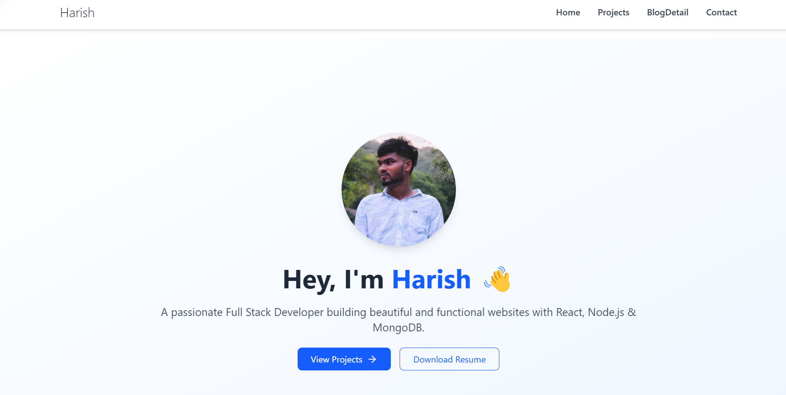
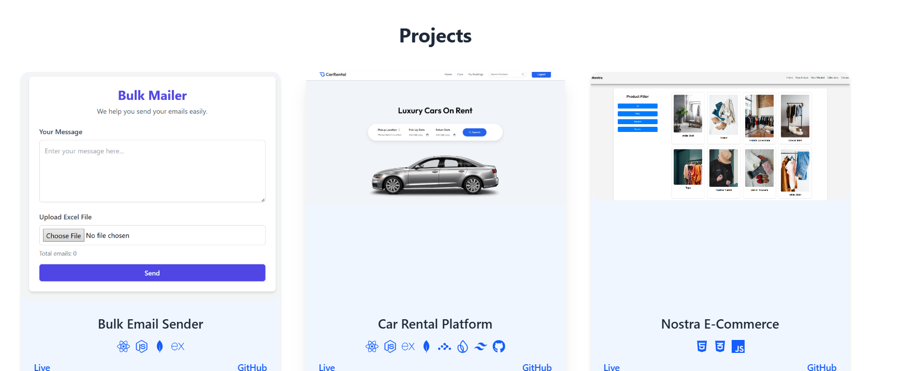

# 💼 Harish's Developer Portfolio

A modern, responsive developer portfolio built using **React** and **Tailwind CSS**, showcasing my journey, projects, skills, and final full-stack applications.

## 🚀 Features

- ⚛️ Built with React + Tailwind CSS
- 🌗 Clean dark-light agnostic design (currently light-themed)
- 🧠 Projects displayed with live preview and GitHub links
- 🛠 Skills represented with icons
- 📱 Fully responsive for all devices
- 📘 DevLog-style blog page for final project explanation
- 🧾 Contact page for connection

---

## 🖥️ Tech Stack

- **Frontend:** React, Tailwind CSS, React Router
- **Deployment:** Vercel / GitHub Pages
- **Icons:** Lucide React, Tech logos

---

## 📂 Pages & Routes

| Route | Description |
|-------|-------------|
| `/` | Home with Hero, Skills, Featured Projects |
| `/projects` | All major projects with live/GitHub |
| `/contact` | Contact form and links |
| `/blogs` | Blog/DevLogs (includes detailed writeup of Car Rental Project) |

---

## 🔥 Highlight Project

### 🚗 Car Rental Platform – MERN Stack

> A complete full-stack application with user login, owner dashboard, payment integration, and booking system.

- Firebase Auth (Google Login)
- Razorpay Payment Gateway
- MongoDB Atlas Backend
- Owner/Admin Flow

📎 [Live Link](https://carrental-ecommerce.vercel.app)  
📁 [GitHub Repo](https://github.com/Harish-Kuppusamy/carrental-ecommerce)

---

## 📷 Screenshots




---

## 📦 Installation

```bash
# Clone the repository
git clone https://github.com/Harish-Kuppusamy/final-portfolio.git

# Install dependencies
npm install

# Start the development server
npm run dev
